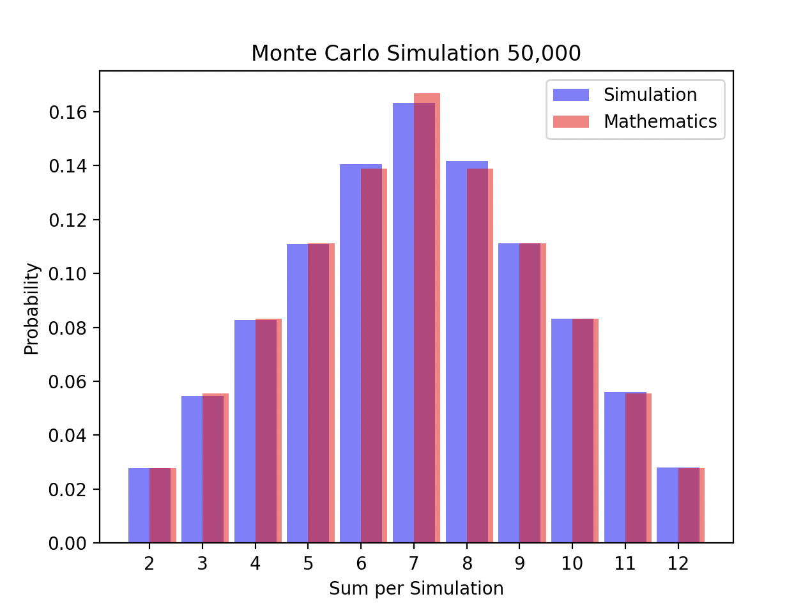

# Monte Carlo Dice Simulation Analysis

## Overview
This document presents the findings from a Monte Carlo simulation of rolling two dice. The simulation was run 50,000 times to estimate the probabilities of rolling sums between 2 and 12.

## Methodology
Two virtual dice were rolled 50,000 times. The sum of the numbers on both dice was recorded for each roll, and the frequency of each sum was used to calculate the probability of its occurrence.

## Simulated Probabilities vs Mathematical Probabilities
The simulation results were then compared to the mathematical probabilities of rolling each sum, which are based on combinatorial analysis.

## Findings

### Similarity of Results
The simulated probabilities closely align with the mathematical probabilities. This is expected because the Monte Carlo method is known to be an effective numerical tool for approximating probabilities through large numbers of random experiments.

### Sample Size and Convergence
The large sample size of 50,000 rolls helped to minimize the impact of random variance and allowed the simulated probabilities to converge closely to the mathematical expectations.

### Trend of Probabilities
Both the simulated and mathematical results show that the probability of rolling sums increases up to 7 and then decreases, which is consistent with the binomial distribution expected from rolling two dice.

## Conclusion
The Monte Carlo simulation has effectively approximated the mathematical probabilities of rolling each possible sum with two dice. The experiment validates the reliability of Monte Carlo methods in statistical experiments and probability estimations.

## Simulation Result Image

